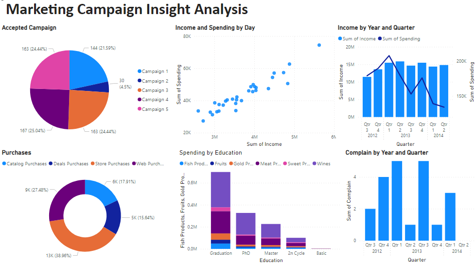

# Marketing-Campaign-Insight-Analysis

#  INTRODUCTION
This is a Power BI project on Marketing Campaign Insight Analysis of an imaginary Company called “UrbanMart” The project is to Analyze and derive insights to answer crucial questions and help the company make data-driven decisions. The dataset, a CSV file contained a single data table structure with  29 Fields and 2,240 records Power BI was used for the analysis.
DISCLAIMER: This dataset and report do not represent any company, institution or country, but just a dummy dataset to demonstrate the capabilities of Power BI.

##  Problem Statement
1.	What is the Relationship between income and spending?
2.	Which Campaign has the highest success rate?
3.	How are Purchases made?
4.	What is the spending based on education?
5.	Identify complaints over time.
6.	What are the income and spending?

##  Skills / Concepts Demonstrated
The following Power BI Features were incorporated
-	D.A.X.
-	Quick Measures.
-	Tooltip.

## Data Transformation
Data cleaning and transformation was carried  out using Power Query
-	After scrutinizing all the columns, they were found to be valid and devoid of empty cells and errors.
-	I checked for duplicate values.

## Data Modelling
No modeling was required since we needed just a table for the analysis.

##  Visualization
Having done the necessary cleaning and transformation, I loaded the datasets into my Power BI  Desktop for analysis and dashboard creation. Below is the generated report.

## Conclusion & Recommendation
The Visual was able to show the Accepted Campaign,  Purchases, Income and Spending by Day, Spending by Education, and Complain trend by year and Quarte, Income and Spending by year and  Quarter.
-	It showed that Income and Spending have a strong positive correlation which means a higher income will result in higher spending and vice-versa.
-	The Campaign 3 and Campaign 5 had the highest Acquisition.
-	Store Purchases made the highest Revenue.
-	Wines generated the highest revenue in all Education qualifications.
-	Higher income led to higher spending in the first quarter of 2012.
-	The rate of customer complaints rose highest in 1st quarter of 2012 and 2013 respectively.

To boost revenue generation, the company was advised to do the following
-	Carry out a market survey analysis to identify customer complaint pattern
-	Ensure that top products are always in stock 
-	Reward top-performing employees
-	Improve general working conditions
-	Improve other campaign channels to boost revenue

